# M.EIC 2023/2024 CPM - 2nd Assignment

## Team

<table border="0" align="center">
    <tr><th colspan="2">Group 3</th></tr>
    <tr><td>Anete Medina Pereira</td><td><a href="https://sigarra.up.pt/feup/pt/fest_geral.cursos_list?pv_num_unico=202008856">202008856</a></td></tr>
    <tr><td>João António Semedo Pereira</td><td>
    <a href="https://sigarra.up.pt/feup/pt/fest_geral.cursos_list?pv_num_unico=202007145">202007145</a></td></tr>
    <tr><td>Mariana Solange Monteiro Rocha</td><td><a href="https://sigarra.up.pt/feup/pt/fest_geral.cursos_list?pv_num_unico=202004656">202004656</a></td></tr>
</table>

## Index

1. [Overview](#overview)
2. [Development Process](#development-process)
3. [App Architecture](#app-architecture)
4. [Libraries Used](#libraries-used)
5. [Navigation Map](#navigation-map)
6. [Performed Test Scenarios and How to Use](#performed-test-scenarios-and-how-to-use)
7. [Before Running](#before-running)

## Overview

Meerkat is a mobile app developed for a project regarding the Mobile Computing course.

The name is a pun on the similarity between 'market' and 'meerkat,' with our icon being a friendly-looking meerkat.

This application is thought to provide an accessible and informative way of analyzing and comparing the evolution on the stock market of different companies.

Its main functionalities include:

- visualization of the stocks of 10 companies
- visualization of the stocks of a company on a candle chart or on a mountain chart
- choose the date visualization (today, past week, past month...)
- check news related to market trends
- filter news per company
- search for a company
- compare two companies stocks

## Development Process

The first thing we did before starting to work on this project was brainstorming ideas of what we could implement on the application with the information available on the API. Then, we projected some mock-ups using Figma to visually help us during the development.

### Mock-ups on Figma

The initial phase of the project involved designing interactive mock-ups in Figma to visually represent the application's user interface, in which we took inspiration to develop the app. The Figma mock-ups can be accessed [trought this hyperlink](https://www.figma.com/design/be4fFeNXVfwz2kkCn2Rdp2/App?node-id=516-1980).

### Iterative Improvement

Firstly, we started developing the essential features that were described on the project specification. After that, we implemented the extra features we brainstormed starting by the ones we thought would be more useful for users.

## App Architecture

Our application is built on the Flutter framework, which serves as the core of our mobile app development.

We used a very simple architecture, with the main components being:

- **Providers**: Built using the Riverpod library, these manage the app's global state and cache the data fetched from the APIs.
- **Models**: These represent the app's state and/or the data fetched from the APIs.
- **API Clients**: These represent the APIs themselves, and are used to fetch data from the APIs.
- **Widgets**: These are the app's UI components. As many of them as possible are stateless, to keep the app's state management simple and reduce potential bugs.
- **Screens**: These are the app's pages, which are built using the widgets.
- **Consumers**: These are the widgets that consume data from the providers, or change the app's state.

The data flow is simple: the API clients fetch data from the APIs, which is then stored in the providers.
Any consumers that need this data access it directly from the providers, and any changes to the app's state is immediately reflected in the UI.

The app is integrated with two distinct APIs that serve important information indispensable for our app's functionalities:

1. **[Alpha Vantage API](https://www.alphavantage.co/)**: This is the API recommended on the instructions of the project. We initially used only this service to gather all the information we wanted, but since the number of daily requests is very limited that affected our progress and would also make the app very restricted to users who could only use some of the functionalities only a few times per day.
   Given this, we decided to search for a new API to use for actions that would require a greater number of request, but we still used Alpha Vantage to gather all of the news information.

2. **[TwelveData API](https://twelvedata.com/)**: This API is the one we chose after facing some problems with the one referred above. This is used for real time as well as historical data on the financial market, which includes stock prices, technical analysis and time series data.

The integration of these APIs ensures our Flutter app provides comprehensive market insights, offering an informative environment.

<div align="center">


###### Figure 1 - Meerkat Architecture

</div>

## Libraries Used

The following libraries were used when developing the app:

- **Dio**: Used as an HTTP client for making requests to the APIs.
- **Envied**: Used to load environment variables, like API keys.
- **FL Chart**: Used to render the charts. We needed to use a custom fork, as the original package didn't have a feature we needed.
- **Flutter Localizations/Intl**: Used to handle the app's localization.
- **Freezed/Json Serializable**: Used to automatically generate serialization code for our models.
- **Retrofit**: Used to generate a custom client for the APIs we used.
- **Riverpod**: Used to manage the app's global state and to cache the data fetched from the APIs.
- **Url Launcher**: Used to open the news articles in the browser.

## Navigation Map

The diagram below represents tha navigation map of our application. External pages can be accessed through the news articles that appear on the news page, company page and the initial page.

<div align="center">


###### Figure 2 - Meerkat Navigation Map

</div>

## Performed Test Scenarios and How to Use

### Visualization of the stocks of 10 companies

When the user opens the app this is the first page that will show up.

<div align="center">

  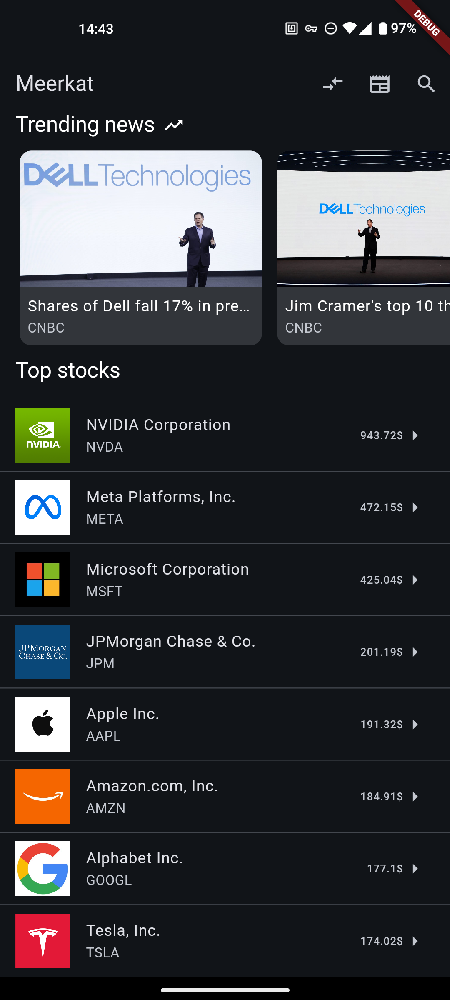

###### Figure 3 - Initial Page

</div>

This page contains 10 company stocks and some news. To visualize the stock of any of these companies all the user should do is click the desired one and a page similiar to the one below this will appear. This page aggregates the evolution of the stock market for a specific company, some technical details useful for market analysis and news related to the company. Every company has a page like this.

<div align="center">

<p align="center">
  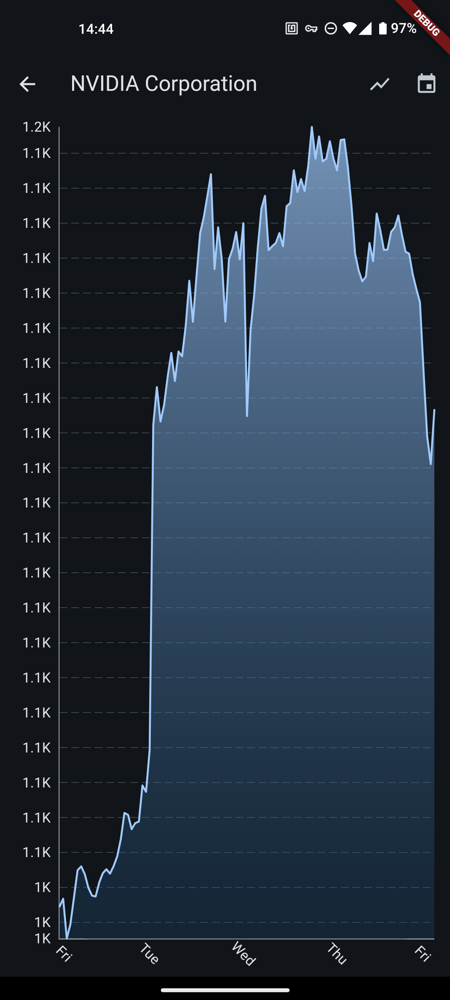
  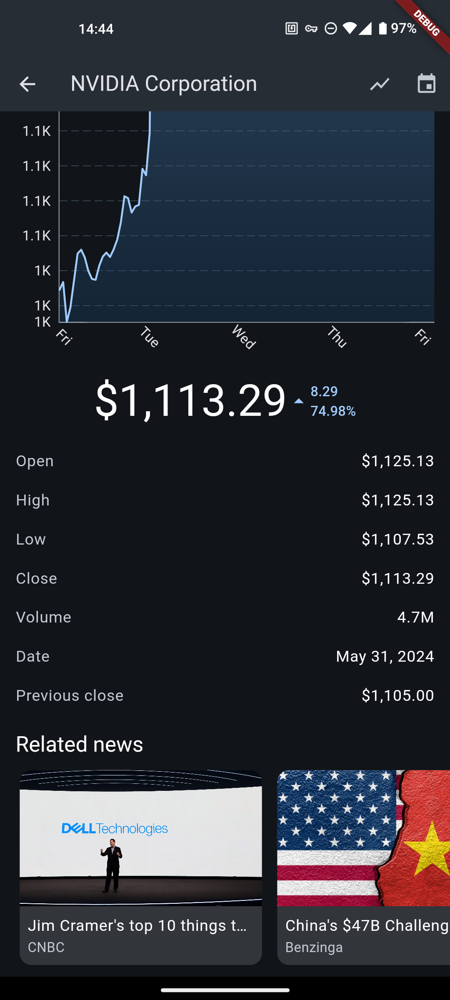
</p>

###### Figure 4 - Company Information Page

</div>

### Visualization of the stocks of a company on a candle chart or on a mountain chart

Furthermore, users can choose if they want to see the information on a candle or mountain chart.
This option can be found clicking the icon on the left side of the calendar,

By hovering over the chart, users can see specific values for each data point, enhancing their ability to interpret the stock trends.

<div align="center">

<p align="center">
  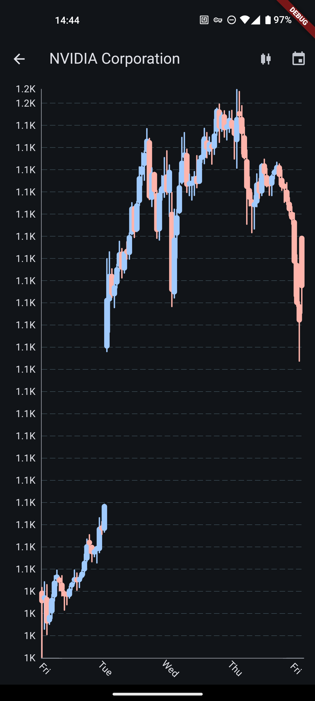
    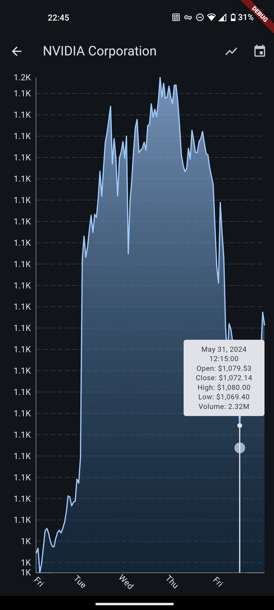
</p>

###### Figure 5 - Change type of chart

</div>

### Choose the date of the visualization

The interval of time of the evolution of the stock can be changed clicking the calendar icon on the top bar.

<div align="center">

<p align="center">
  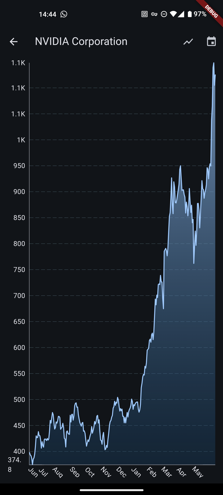
</p>

###### Figure 6 - Change time interval of chart

</div>

### Check news related to market trends

News related to market trends can be found in three distinct pages: on the top of the initial page, on the bottom of the company page and a page dedicated to only news by clicking the newspaper icon on the initial page.

For those who want to invest in the stock market it is very important to be aware of the most recent events surrounding a company since they can help predict the future of the company.

<div align="center">

<p align="center">
  
  
  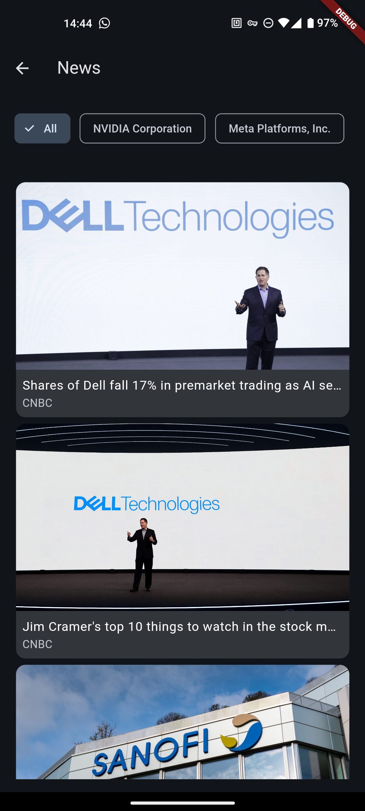

</p>

###### Figure 7 - From left to right: initial page, company page and news only page

</div>

### Filter news per company

To create a more user-friendly experience we allow users to filter news per company so they can see which news are related to the company they are interested in.

To do so, all one has to do is click the name of the intended company on the top of the screen.

<div align="center">

<p align="center">
  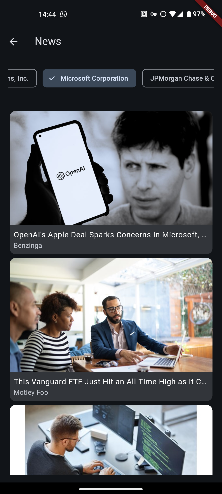
</p>

###### Figure 8 - Filter news 

</div>

### Search for a Company

The search functionality in Meerkat allows users to easily find and display information about specific companies listed in the app. This feature is designed to enhance user experience by providing quick access to stock data for a particular company without manually browsing through the list.

<div align="center">

<p align="center">
  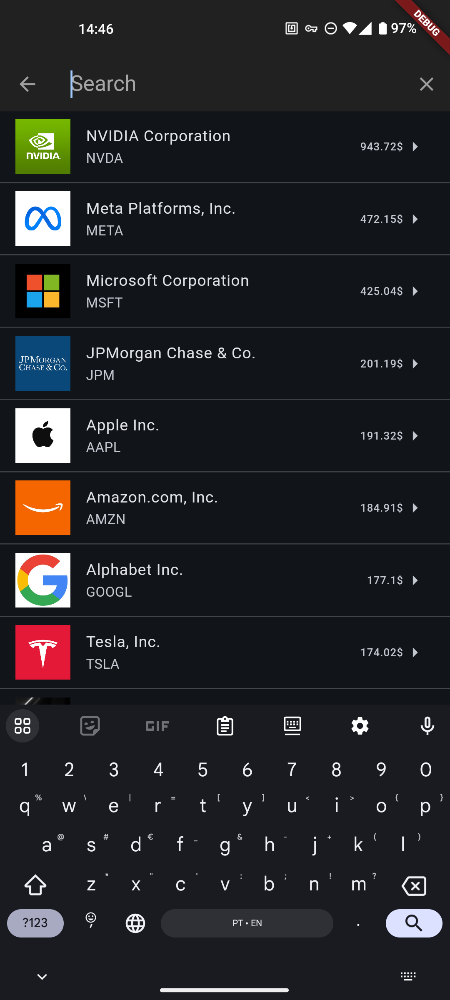
  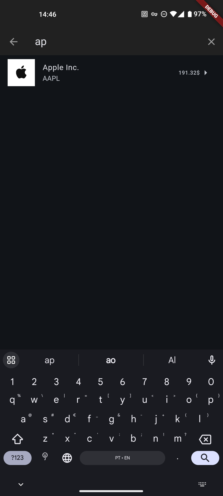
</p>

###### Figure 9 - Search page 

</div>

### Compare Two Companies' Stocks

The users can compare the stock performance of two companies.
This is a key feature of Meerkat, enabling the users to analyze and contrast the stock trends of different companies over a specified period.

<div align="center">

<p align="center">
  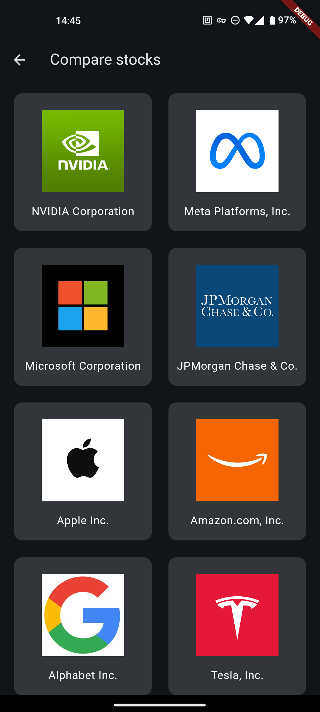
  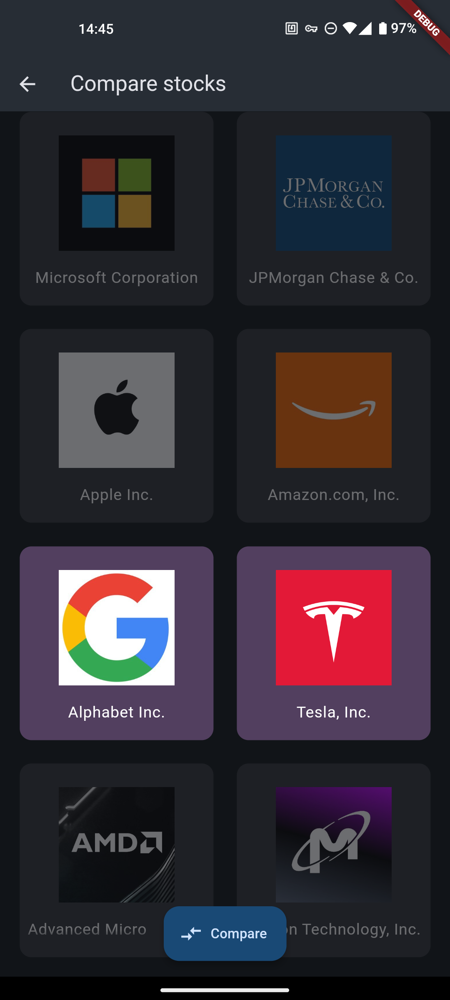
  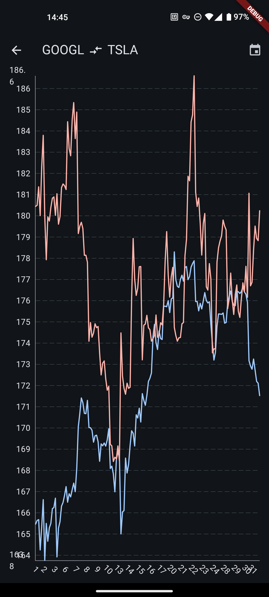
</p>

###### Figure 10 - Compare page before selecting companies to compare and after selecting

</div>

## Before Running

Before running the app, you need to create a `.env` file in the root of the project with the following content:

```env
ALPHA_VANTAGE_KEY=<your_alpha_vantage_key>
TWELVE_DATA_KEY=<your_twelve_data_key>
```

Then, you need to run the following command to run the code generation:

```bash
flutter pub get
flutter pub run build_runner build
```

After that, you can run the app using the following command:

```bash
flutter pub get
flutter run
```

## References

[Alpha Vantage API](https://www.alphavantage.co/): Used for fetching stock price data and news.

[TwelveData API](https://twelvedata.com/): Used for historical and real-time stock data, providing a larger number of requests for improved user experience.
